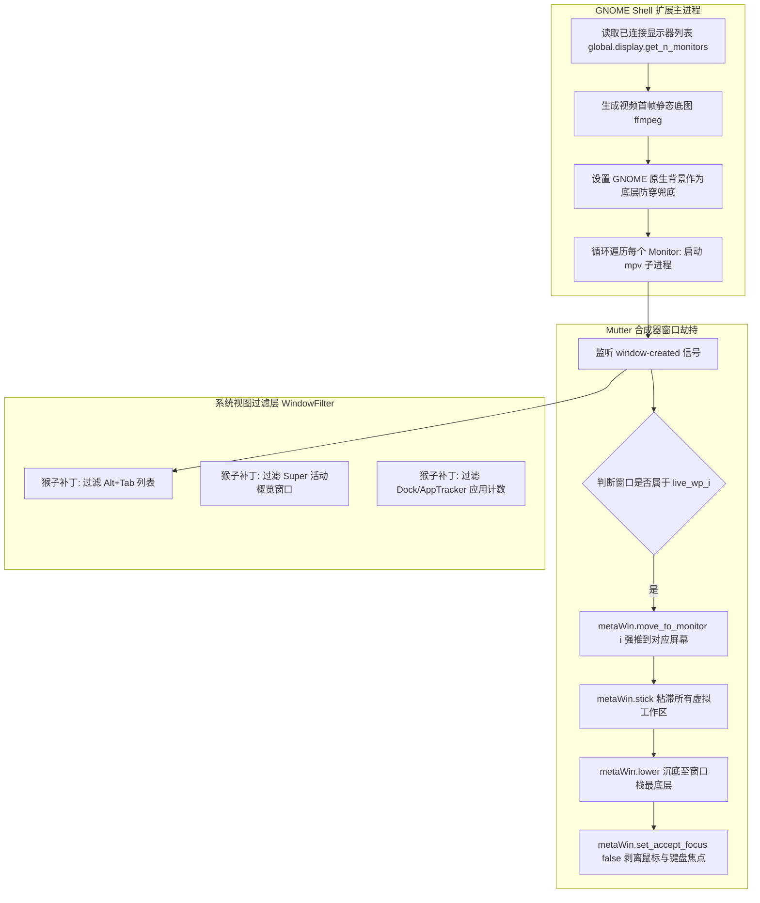

# GNOME 50 多屏动态壁纸扩展 (MultiLiveWallpaper)
## 产品需求与技术架构设计文档 (PRD & Technical Spec)

---

## 1. 产品概述与目标

### 1.1 背景
在现代 Linux 桌面（尤其是 **Ubuntu 26.04 / GNOME 50 + Wayland**）环境下，传统动态壁纸方案面临严重水土不服：
- 老旧工具（如 Komorebi、Hidamari）基于 X11，无法在 Wayland 会话中定位底层窗口；
- 侵入式扩展（如 Hanabi）在 GNOME 50 下由于双屏 BackgroundActor 映射逻辑缺陷导致崩溃或被 `Win + D` 误杀最小化；
- 新兴扩展（如 Gnome Live Wallpaper）目前仅支持单屏（主显示器）。

### 1.2 产品定位
**MultiLiveWallpaper** 是一款专门针对 **Ubuntu 26.04 (GNOME 50) + Wayland** 环境打造的轻量级、原生多显示器动态壁纸扩展。

### 1.3 核心设计目标
1. **多屏幕同步铺满**：自动检测所有已连接的显示器（`DP` / `HDMI`），为每台显示器独立映射动态壁纸。
2. **防最小化穿透 (`Win + D`)**：当用户按下 `Win + D` 显示桌面时，底层视觉无缝衔接，绝不暴露 Ubuntu 原生默认壁纸。
3. **工作区无缝漫游**：跨虚拟工作区切换时，壁纸持续常驻播放，无白屏或瞬断。
4. **系统级伪装隐形**：在 Alt+Tab、活动概览（Overview）、系统任务栏（Dock）中完全隐形，不夺取任何输入焦点。
5. **极低资源开销**：基于 `mpv` 硬件加速解码（VA-API / NVDEC），双 4K 播放下 CPU 占用率控制在 5% 以内。

---

## 2. 系统核心架构设计

### 2.1 整体架构流程图



---

## 3. 技术难点与核心解法

> [!IMPORTANT]
> **Wayland 的客户端隔离限制**：在 Wayland 协议下，常规客户端（如独立运行的 mpv）被剥夺了自行设定窗口绝对坐标、屏幕序号与 Z 轴层级的权限。因此，**必须将扩展代码注入 GNOME Shell（Mutter 合成器）内部**，利用合成器的最高内部特权完成窗口操控。

### 3.1 痛点一：`Win + D` 最小化时动态壁纸消失
- **原因分析**：Wayland 下运行的播放器窗口本质上是普通应用程序窗口。当触发 `Win + D`（显示桌面）时，窗口管理器会下发 `minimize_all` 广播，导致播放窗口被收起，露出底层的静态桌面。
- **解法（双保险机制）**：
  1. **静态底图兜底（Static Fallback）**：启动视频前，调用 `ffmpeg` 提取视频在第 1 秒的画面保存为 `~/.cache/live-wallpaper/thumb.jpg`，并通过 GSettings 直接写入 `org.gnome.desktop.background picture-uri`。即便窗口最小化，底层露出的也是相同画面的静态图，视觉上完全不闪烁。
  2. **强制置底锁（Keep Lowered）**：监听 `window.connect('raised')` 和 `global.display.connect('window-created')`，任何时候只要检测到图层变化，立即强制执行 `metaWin.lower()`。

### 3.2 痛点二：多显示器自动分发与定位
- **原理**：
  - 遍历显示器：`const count = global.display.get_n_monitors()`。
  - 为每个屏幕启动带唯一标识标题的 `mpv` 进程：
    `mpv --title=live_wp_0 ...` 与 `mpv --title=live_wp_1 ...`
  - 在 GNOME Shell 捕获到窗口创建事件后，调用 Mutter 内部 API：
    `metaWin.move_to_monitor(monitorIndex)` 将其强制迁移至目标屏幕，并调用 `metaWin.maximize(Meta.MaximizeFlags.BOTH)` 填满显示区域。

### 3.3 痛点三：跨虚拟工作区切换黑屏
- **原理**：
  - 调用 `metaWin.stick()`。该方法将窗口从具体的某个 `Workspace` 独立出来，使其成为跨工作区常驻窗口（Pinned/Sticky Window）。

### 3.4 痛点四：伪装与系统级隐藏（Stealth）
避免动态壁纸在系统使用中“穿帮”：
1. **Alt + Tab**：重写 `Meta.Display.prototype.get_tab_list`，过滤掉壁纸窗口。
2. **Super 键（活动概览）**：重写 `Workspace.Workspace.prototype._isOverviewWindow`，避免壁纸窗口缩小浮动在活动视图中。
3. **Ubuntu Dock 任务栏**：重写 `Shell.WindowTracker.prototype.get_window_app`，防止 mpv 在 Dock 上出现运行图标和小圆点。

---

## 4. 项目工程结构规范

项目目录统一安装于本地扩展目录：
`~/.local/share/gnome-shell/extensions/multilive-wallpaper@local/`

```text
multilive-wallpaper@local/
├── metadata.json           # 扩展元数据声明（适配 GNOME 50）
├── extension.js            # 扩展生命周期管理入口 (enable / disable)
├── modules/
│   ├── wallpaperManager.js # 核心管理器：负责 mpv 进程派生、显示器分发
│   ├── windowFilter.js     # 隐形过滤：猴子补丁屏蔽 Alt+Tab、Overview、Dock
│   ├── staticFallback.js   # 静态兜底：ffmpeg 抽帧与原生 background 写入
│   └── utils.js            # 工具函数：路径构建、命令检测
├── ui/
│   └── indicator.js        # 顶栏托盘组件（PanelMenu）
└── stylesheet.css          # 自定义菜单样式（可选）
```

---

## 5. 模块详细设计与核心代码实现

### 5.1 `metadata.json`
定义扩展元数据，明确限定仅运行于 GNOME 50 环境：
```json
{
  "name": "Multi-Display Live Wallpaper",
  "description": "Native multi-monitor live wallpaper extension for Ubuntu 26.04 (GNOME 50) on Wayland.",
  "uuid": "multilive-wallpaper@local",
  "shell-version": ["50"],
  "version": 1,
  "url": "https://github.com/your-username/multilive-wallpaper"
}
```

### 5.2 `modules/wallpaperManager.js`（核心调度模块）
负责根据屏幕数量启动与控制多个 `mpv` 实例，并在合成器层分发定位。

```javascript
import Gio from 'gi://Gio';
import GLib from 'gi://GLib';
import Meta from 'gi://Meta';
import { StaticFallback } from './staticFallback.js';

export class WallpaperManager {
    constructor(ext) {
        this._ext = ext;
        this._processes = [];
        this._windowCreatedId = null;
        this._monitorsChangedId = null;
        this._wallpaperWindows = new Map(); // monitorIndex -> metaWindow
        this._staticFallback = new StaticFallback();
    }

    start(videoPath) {
        this.stop();
        if (!videoPath || !GLib.file_test(videoPath, GLib.FileTest.EXISTS)) return;

        // 1. 设置静态底图兜底，防止 Win + D 露底
        this._staticFallback.applyFallback(videoPath);

        const nMonitors = global.display.get_n_monitors();

        // 2. 监听窗口创建事件
        this._windowCreatedId = global.display.connect('window-created', (_, metaWin) => {
            this._handleWindowCreated(metaWin);
        });

        // 3. 监听多显示器热插拔/分辨率改变事件
        this._monitorsChangedId = global.display.connect('monitors-changed', () => {
            this.start(videoPath); // 重新规划屏幕分发
        });

        // 4. 为每个显示器分别派生独立播放进程
        for (let i = 0; i < nMonitors; i++) {
            const title = `live_wallpaper_screen_${i}`;
            const cmd = [
                'mpv',
                '--no-border',
                '--loop=inf',
                '--no-audio',
                '--force-window=yes',
                '--ontop=no',
                '--keep-open=yes',
                '--geometry=100%x100%',
                '--no-osc',
                '--no-osd-bar',
                `--title=${title}`,
                `--x11-name=${title}`,
                '--panscan=1.0',
                '--video-unscaled=no',
                '--input-default-bindings=no',
                '--input-vo-keyboard=no',
                '--cursor-autohide=no',
                '--hwdec=auto',
                videoPath
            ];

            try {
                const proc = Gio.Subprocess.new(cmd, Gio.SubprocessFlags.NONE);
                this._processes.push(proc);
            } catch (err) {
                console.error(`[MultiWallpaper] Failed to spawn mpv for screen ${i}:`, err);
            }
        }
    }

    _handleWindowCreated(metaWin) {
        const title = metaWin.get_title();
        if (!title || !title.startsWith('live_wallpaper_screen_')) return;

        const monitorIndex = parseInt(title.replace('live_wallpaper_screen_', ''), 10);
        if (isNaN(monitorIndex)) return;

        // 延迟 50ms 确保 Wayland Surface 与 Mutter 窗口树完全建立
        GLib.timeout_add(GLib.PRIORITY_DEFAULT, 50, () => {
            if (!metaWin) return GLib.SOURCE_REMOVE;

            // 强推至对应显示器
            metaWin.move_to_monitor(monitorIndex);
            metaWin.maximize(Meta.MaximizeFlags.BOTH);
            metaWin.stick();                   // 跨虚拟工作区常驻
            metaWin.lower();                   // 沉入底图层
            metaWin.focus_on_click = false;

            try {
                metaWin.set_accept_focus(false); // 不接收焦点
            } catch (_) {}

            this._wallpaperWindows.set(monitorIndex, metaWin);

            // 注册防止被置顶的常驻下沉信号
            metaWin.connect('raised', () => metaWin.lower());

            return GLib.SOURCE_REMOVE;
        });
    }

    stop() {
        if (this._windowCreatedId) {
            global.display.disconnect(this._windowCreatedId);
            this._windowCreatedId = null;
        }
        if (this._monitorsChangedId) {
            global.display.disconnect(this._monitorsChangedId);
            this._monitorsChangedId = null;
        }

        for (const proc of this._processes) {
            try {
                proc.force_exit();
            } catch (_) {}
        }
        this._processes = [];
        this._wallpaperWindows.clear();
    }
}
```

### 5.3 `modules/staticFallback.js`（首帧防露底模块）
```javascript
import Gio from 'gi://Gio';
import GLib from 'gi://GLib';

export class StaticFallback {
    constructor() {
        this._bgSettings = new Gio.Settings({ schema_id: 'org.gnome.desktop.background' });
    }

    applyFallback(videoPath) {
        const cacheDir = GLib.build_filenamev([GLib.get_user_cache_dir(), 'multilive-wallpaper']);
        GLib.mkdir_with_parents(cacheDir, 0o755);

        const thumbPath = GLib.build_filenamev([cacheDir, 'current-bg.jpg']);

        // 异步提取视频在 00:00:01 的第一帧作为静态底图
        try {
            const proc = Gio.Subprocess.new([
                'ffmpeg', '-y',
                '-ss', '00:00:01',
                '-i', videoPath,
                '-frames:v', '1',
                thumbPath
            ], Gio.SubprocessFlags.NONE);

            proc.wait_check_async(null, (source, res) => {
                try {
                    source.wait_check_finish(res);
                    const uri = GLib.filename_to_uri(thumbPath, null);
                    this._bgSettings.set_string('picture-uri', uri);
                    this._bgSettings.set_string('picture-uri-dark', uri);
                    Gio.Settings.sync();
                } catch (e) {
                    console.error('[MultiWallpaper] Thumbnail fallback generation failed:', e);
                }
            });
        } catch (e) {
            console.error('[MultiWallpaper] Failed to launch ffmpeg:', e);
        }
    }
}
```

### 5.4 `modules/windowFilter.js`（隐形模块）
通过安全地 Monkey-Patch Mutter 内部方法，使动态壁纸窗口对用户桌面操作“隐形”：
```javascript
import Meta from 'gi://Meta';
import Shell from 'gi://Shell';
import * as Workspace from 'resource:///org/gnome/shell/ui/workspace.js';

export class WindowFilter {
    constructor() {
        this._patches = [];
    }

    _isWallpaper(metaWin) {
        if (!metaWin) return false;
        const title = metaWin.get_title();
        return typeof title === 'string' && title.startsWith('live_wallpaper_screen_');
    }

    enable() {
        // 1. 从 Alt+Tab 切换窗口列表中排除
        this._patch(Meta.Display.prototype, 'get_tab_list', (original) => {
            const self = this;
            return function (type, workspace) {
                return original.call(this, type, workspace).filter(win => !self._isWallpaper(win));
            };
        });

        // 2. 从 Super 键活动概览视图中排除
        this._patch(Workspace.Workspace.prototype, '_isOverviewWindow', (original) => {
            const self = this;
            return function (win) {
                if (self._isWallpaper(win)) return false;
                return original.call(this, win);
            };
        });

        // 3. 从系统应用追踪器（Dock 小圆点）中排除
        this._patch(Shell.WindowTracker.prototype, 'get_window_app', (original) => {
            const self = this;
            return function (win) {
                if (self._isWallpaper(win)) return null;
                return original.call(this, win);
            };
        });
    }

    _patch(obj, method, wrapper) {
        const original = obj[method];
        this._patches.push({ obj, method, original });
        obj[method] = wrapper(original);
    }

    disable() {
        for (const { obj, method, original } of this._patches) {
            obj[method] = original;
        }
        this._patches = [];
    }
}
```

---

## 6. 测试与验收指标 (Verification Matrix)

| 场景用例 | 预期行为 | 判定标准 |
| :--- | :--- | :--- |
| **TC-01 多显示器填充** | 主副屏（DP-1 与 DP-2）开机同时播放动态视频 | 两个屏幕画面完整且贴合，无黑边或坐标漂移 |
| **TC-02 最小化所有窗口 (`Win + D`)** | 按下 `Win + D` 快捷键收起应用 | 动态壁纸不退出；即使触发最小化也因静态首帧兜底而**不出现**紫底 |
| **TC-03 虚拟工作区切换** | 按 `Super + PageDown` 切换至工作区 2/3 | 动态壁纸在所有工作区保持持续无缝播放 |
| **TC-04 窗口交互穿透** | 在桌面空白处点击鼠标右键、框选图标 | 菜单正常弹出，框选框无卡顿，无任何焦点争抢 |
| **TC-05 概览与应用切换** | 按 `Alt + Tab` 或点击 `Super` 键 | 任务列表中绝不出现 `live_wallpaper` 或 mpv 窗口 |
| **TC-06 硬件性能消耗** | 双 1440p 60fps 循环播放持续 30 分钟 | 开启硬件加速（`--hwdec=auto`）下，CPU 占用率 `<= 6%` |

---

## 7. 部署与调试指引

### 7.1 本地测试快捷命令
```bash
# 1. 链接或创建扩展目录
mkdir -p ~/.local/share/gnome-shell/extensions/multilive-wallpaper@local

# 2. 启用扩展
gnome-extensions enable multilive-wallpaper@local

# 3. 实时查看 GNOME Shell 调试日志
journalctl -f -o cat /usr/bin/gnome-shell | grep -i "MultiWallpaper"
```

### 7.2 卸载与重置
```bash
gnome-extensions disable multilive-wallpaper@local
rm -rf ~/.local/share/gnome-shell/extensions/multilive-wallpaper@local
```
